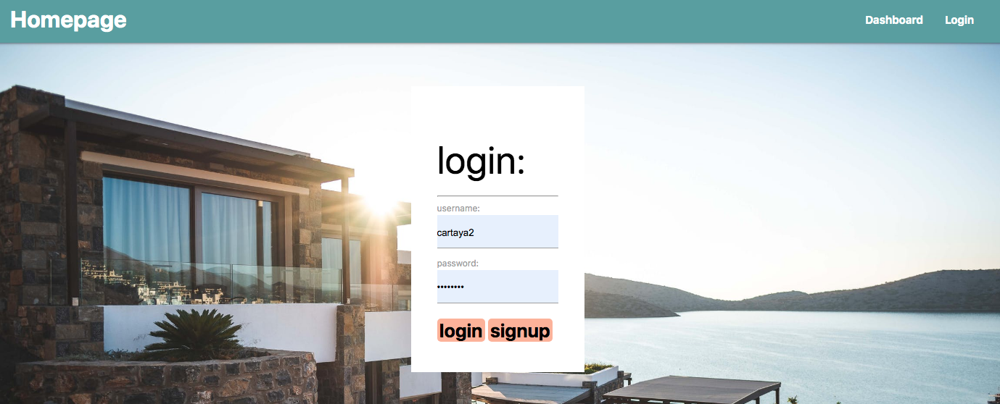
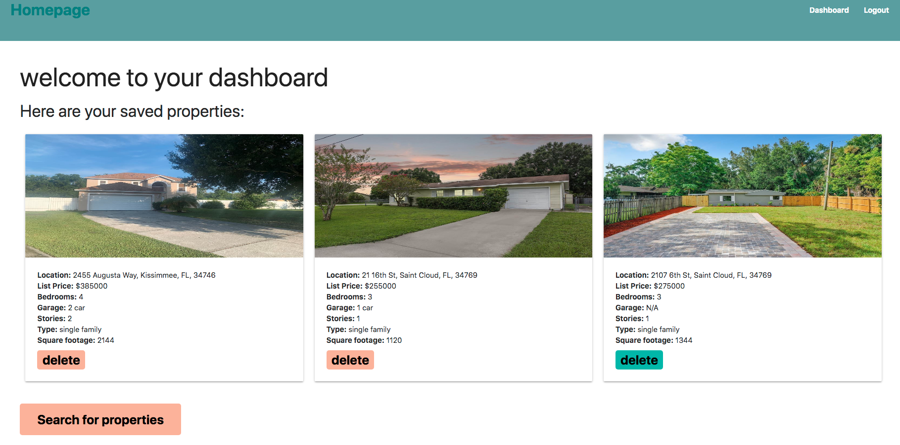
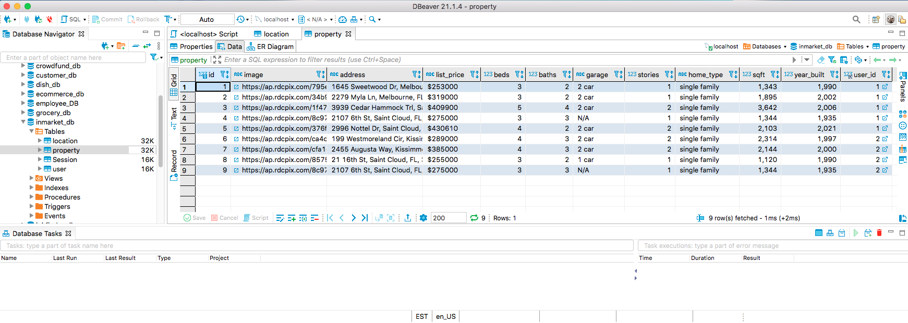

# inMarket Real Estate Search Application


# Description 

Developers are often tasked with creating interfaces that make it easy for non-developers to view and interact with information stored in databases, commonly known as Content Management Systems. In this homework assignment, the challenge was to build an application utilizing Node.js, Sequelize, Handlebars.js, and deploy it to Heroku.

Los desarrolladores a menudo tienen la tarea de crear interfaces que faciliten a los no desarrolladores ver e interactuar con la información almacenada en las bases de datos. A menudo, estas interfaces se conocen como sistemas de gestión de contenido. En esta tarea, el desafío era diseñar y construir una Aplicacion usando node, inquirer y MySQL.


# Motivation 

Anyone who has ever experienced the home buying process knows that it can be stressful.  This application is intended to assist the user by allowing them to search for homes in their area using their chosen search criteria, making the search for their 'home sweet home' a little easier.  

Cualquiera que haya experimentado el proceso de compra de una vivienda sabe que puede ser estresante. Esta aplicación está destinada a ayudar al usuario permitiéndole buscar casas en su área utilizando los criterios de búsqueda elegidos, lo que facilita un poco la búsqueda del "hogar, dulce hogar".

# Table of Contents

* [Demo](#demo)
* [Technology](#technology)
* [Usage](#usage)
* [Features](#features)
* [License](#license)
* [Contribution](#contribution)
* [Questions](#questions)
* [GitHub](#github)

# User Story : 

```
As a User: 
I want to be able to view and search for Homes in my area
So that I can plan to buy or rent a property in the future
When I log in I can view my saved properties, 
Then when I log out, I am taken back to the home page.


Como Usuario:
Quiero poder ver y buscar los Apartamentos y casas de mi Area.
Para que pueda organizar y planificar mi futuro negocio.
```

# Demo 








# Technology
**1. [MySQL2](https://www.npmjs.com/package/mysql2) NPM package** : 

* A relational database organizes data into one or more data tables in which data types may be related to each other; these relations help structure the data.
* SQL is used by language programmers to create, modify and extract data from the relational database, as well as control user access to the database.

**2. [Node.js](https://nodejs.org/en/)** : 

* Node.js is an open-source and cross-platform JavaScript runtime environment. 

* A Node.js app is run in a single process, without creating a new thread for every request. 

* Node.js provides a set of asynchronous I/O primitives in its standard library that prevent JavaScript code from blocking.

**3. [Express](https://www.npmjs.com/package/express)** :
* Express web framework for Node.js which allows routing, middleware and the view system. 

**4. [Sequelize](https://www.npmjs.com/package/sequelize)** :
* Application uses Sequelize, which is a promise-based Node.js ORM for Postgres, MySQL, SQL Server.


**4. [Axios](https://www.npmjs.com/package/axios)**:

* Make XMLHttpRequests from the browser
* Make http requests from node.js
* Intercept request and response
* Transform request and response data
* Cancel requests
* Automatic transforms for JSON data
* Client side support for protecting against XSRF

* We used this NPM package to add the API information to our own database

# Usage
* Clone this repository to use this application on local machine.

* To install necessary dependencies, run the following command :

```
npm i
```

* The application will be invoked with the following command : 

```
npm start
```

# Features
1. Uses Express Sequelize framework for Node.Js. 

2. Uses Real State Rapid API to locate homes in the area of the user search.

3. User can then view all Homes in the City or State searched.

4. User can add Properties to their DashBoard once logged in.

5. Created three tables - Properties, Users and Locations. These tables are connected with primary and foreign keys.

6. Included a `schema.sql` to hold databse schema and relation file to API database. This makes development of individual features much easier.


# License
This project is under .

# Contribution
 


Pull requests are always welcome!

# Questions
If you have any questions about the repo, 
[open an issue](https://github.com/RLAQUEA/project-2/issues) 

# GitHub
Binary Beasts

- Alex Abbamondi
- Luis R. Cartaya
- Cristian Cuevas
- Rachel LaQuea 
- Kyle M Mularoni


[Link to GitHub Repository](https://github.com/RLAQUEA/project-2)

[Heroku Deployed Site](https://fierce-waters-10639.herokuapp.com/)

